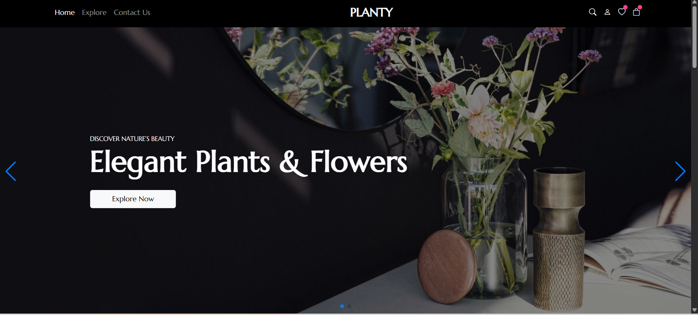
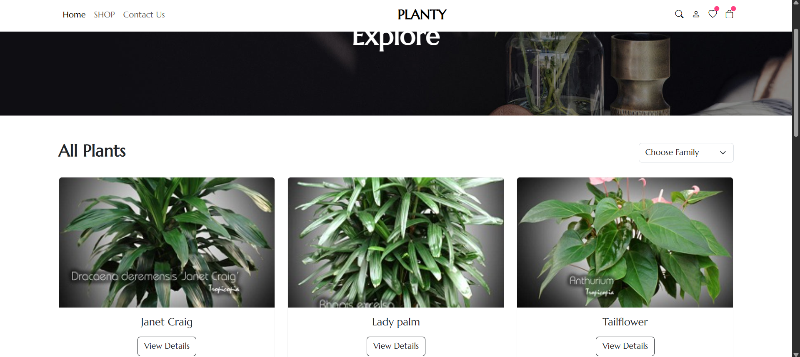
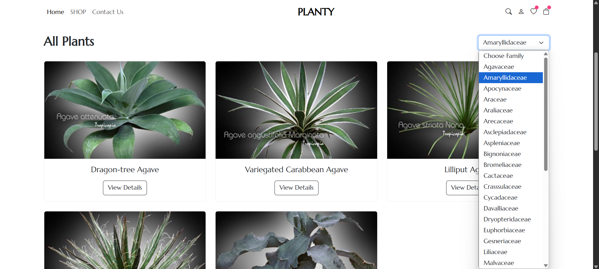
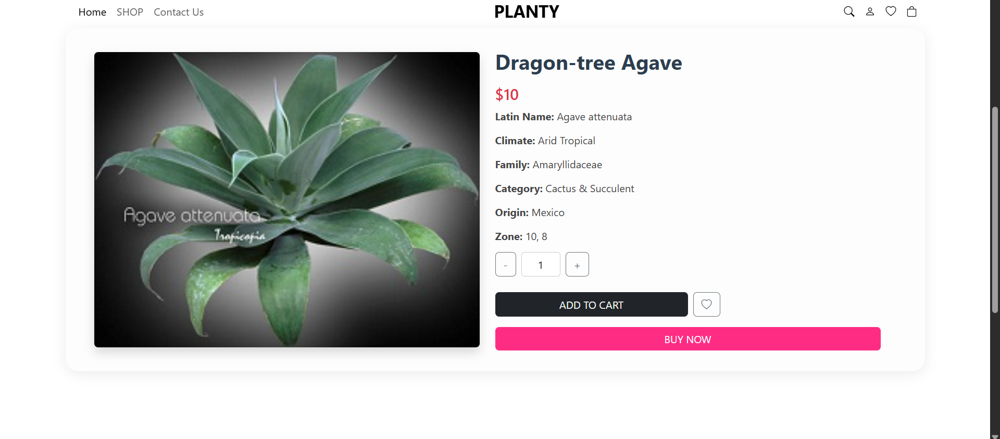
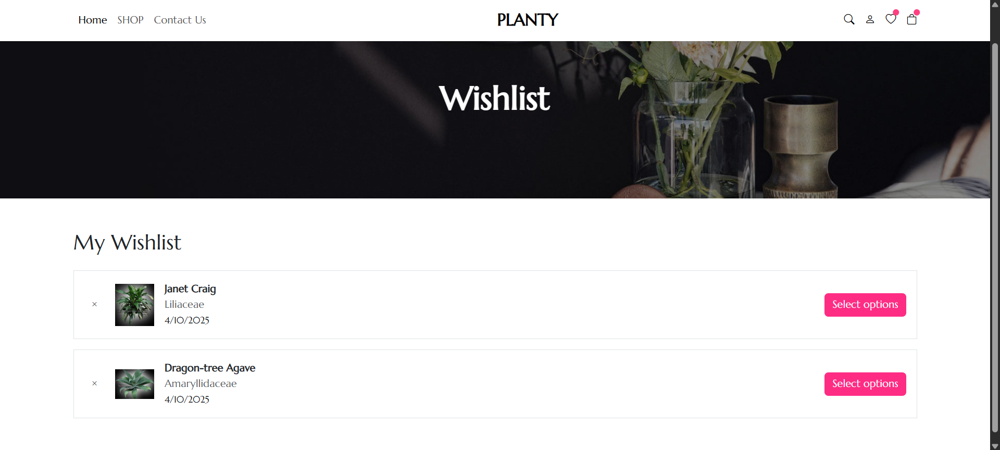

# 🌿 Planty - House Plants Explorer

This is a web-based project that fetches and displays house plants data using a public API. The project was developed for Assignment 1 in the **Web Services course** to demonstrate how to consume RESTful APIs using JavaScript.

## 📌 API Used

**API Name:** House Plants 2  
**Provider:** [RapidAPI](https://rapidapi.com/mnai01/api/house-plants2)  
**Endpoint Used:**  
`GET https://house-plants2.p.rapidapi.com/all-lite`

This API provides a list of plants with their Latin name, common name, family, climate, zone, origin, image, and more.

## 🧪 Features

- Fetch data using `fetch()` from the RapidAPI endpoint.
- Display a paginated list of plants.
- Filter plants by **family**.
- View detailed information for each plant.
- Add plants to a **wishlist** (stored using `localStorage`).
- Responsive and modern UI with Bootstrap 5.

#### 🖼️ Screenshots and Descriptions

##### 1. Homepage - Elegant Landing  
  
**Description**: الصفحة الرئيسية للموقع بتعطي لمحة جميلة وعصرية عن متجر PLANTY. فيها زر "Explore Now" اللي بيوصل الزائر لواجهة استكشاف النباتات.

---

##### 2. All Plants Page - Filtering with API  
  
**Description**: هاي الواجهة بتسحب كل النباتات من API خارجي (RapidAPI - House Plants 2)، وبتوفر خيار تصفية حسب الفصيلة (Family). كل نبتة فيها صورة واسم وزر لعرض التفاصيل.

---

##### 3. Family Filtering  
  
**Description**: عند اختيار فصيلة من القائمة، الواجهة بتعرض فقط النباتات اللي بتتبع لهاي الفصيلة، باستخدام التصفية على البيانات المسترجعة من الـ API.

---

##### 4. Plant Details Page  
  
**Description**: عند الضغط على "View Details"، بننتقل لصفحة التفاصيل اللي بتعرض بيانات النبتة بالكامل مثل الاسم اللاتيني، الفصيلة، المناخ، وغيرها. الصفحة بتحتوي على زر "ADD TO CART" وزر لإضافة النبتة إلى الـ wishlist.

---

##### 5. Wishlist Page  
  
**Description**: قائمة الأمنيات (Wishlist) بتعرض النباتات اللي أضافها المستخدم من خلال صفحة التفاصيل. بتنعرض بطريقة منظمة، وبتحتوي على زر لإزالة العنصر، وزر "Select options" لاحقًا ممكن يتم تطويره لإضافة تخصيصات.

